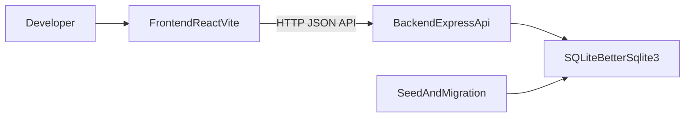

# QA Atlas MVP Roadmap (Beginner Friendly, с нуля)

Этот документ - пошаговый план, как собрать MVP QA Atlas с нуля: фронтенд, бэкенд, база, локальный запуск, базовое тестирование и простой деплой.

Цель MVP: интерактивная QA-карта (папки/элементы/релизы/спринты) с API, которая запускается локально одной командой и готова к развитию.

---

## 1) Актуальная база (что проверить перед стартом)

Перед началом проверь актуальные требования в официальных источниках:

- Vite Getting Started: <https://vite.dev/guide/>
- React Learn: <https://react.dev/learn>
- Node.js releases (LTS): <https://nodejs.org/en/about/releases/>
- Express lifecycle/release notes: <https://expressjs.com/2025/03/31/v5-1-latest-release.html>
- better-sqlite3 (npm): <https://www.npmjs.com/package/better-sqlite3>
- Docker Compose docs: <https://docs.docker.com/compose/>

Почему так: версии меняются. Этот roadmap дает устойчивый workflow, но перед стартом лучше быстро сверить минимальные версии.

---

## 2) Что ты получишь в конце

К моменту завершения roadmap у тебя будет:

- `frontend` на React + Vite
- `backend` на Express
- SQLite через `better-sqlite3`
- REST API для product/folders/releases
- Автомиграция стартовых JSON в SQLite (один раз)
- Единый запуск проекта из корня

---

## 3) Архитектура MVP



---

## 4) Prerequisites для новичка

Установи:

- Node.js LTS (рекомендуется Active LTS)
- npm (обычно вместе с Node)
- Git
- Cursor или VS Code

Проверь:

```bash
node -v
npm -v
git --version
```

Если команды не найдены, сначала почини окружение, иначе дальше будет много ложных ошибок.

---

## 5) Шаг 1. Инициализация проекта (monorepo)

### 5.1 Создай структуру и репозиторий

```bash
mkdir qa-atlas
cd qa-atlas
mkdir backend frontend docs
git init
```

Сразу создай корневой файл `.gitignore`, чтобы не коммитить лишнее:
```text
node_modules/
dist/
.env
backend/data/*.db
```

### 5.2 Инициализируй корень

```bash
npm init -y
npm i -D concurrently
```

Добавь в корневой `package.json`:

- `start`: параллельный запуск frontend и backend
- `start:backend`: запуск backend
- `start:frontend`: запуск frontend

Референс: `package.json` в текущем репо.

Definition of done:

- Из корня есть единая команда запуска (`npm start`)

---

## 6) Шаг 2. Backend (Express + SQLite)

### 6.1 Установка зависимостей

```bash
cd backend
npm init -y
npm i express cors uuid better-sqlite3
```

В `backend/package.json`:

- `"type": "module"`
- script `"start": "node src/index.js"`
- script `"seed": "node src/seed.js"`

### 6.2 Базовая структура

```text
backend/
  src/
    index.js
    db/database.js
    routes/
      product.js
      folders.js
      releases.js
      mutations.js
    store/
      graph.js
      folders.js
      releases.js
    seed.js
  data/
```

### 6.3 Инициализация БД

В `src/db/database.js`:

- открыть `backend/data/qa-atlas.db`
- создать таблицы (`product_settings`, `modules`, `features`, `folders`, `items`, `releases`, comments)
- включить миграцию JSON -> SQLite на первом запуске

Практический совет:

- для SQLite в dev обычно полезно включить WAL (`PRAGMA journal_mode = WAL`) после открытия БД

### 6.4 Подними API сервер

В `src/index.js`:

- `init()` базы до регистрации роутов
- `app.use(cors())`
- `app.use(express.json())`
- порт `4000`

Пример структуры маршрутов:

- `/api/product`
- `/api/folders`
- `/api/releases`
- `/api` (мутации модулей/фич/coverage и т.д.)

Definition of done:

- `npm start` в `backend` поднимает сервер на `http://localhost:4000`

---

## 7) Шаг 3. Frontend (React + Vite)

### 7.1 Создай приложение

```bash
cd ../frontend
npm create vite@latest . -- --template react
npm install
```

### 7.2 Зависимости UI и роутинга

```bash
npm i react-d3-tree d3 react-router-dom
```

*(Совет: для быстрой и красивой стилизации MVP можно сразу добавить Tailwind CSS или использовать обычные CSS-модули).*

### 7.3 Структура фронтенда

```text
frontend/src/
  main.jsx
  App.jsx
  api/atlas.js
  components/
    FolderTree.jsx
    ProductMap.jsx
    FeaturePanel.jsx
    DescriptionPanel.jsx
```

### 7.4 API client

В `src/api/atlas.js` опиши функции:

- чтение (`getProduct`, `getFoldersTree`, `getReleases`)
- CRUD где нужно
- единая обработка не-200 ответов

Definition of done:

- фронт поднимается на `http://localhost:5173`
- данные можно получить из backend API

---

## 8) Шаг 4. Интеграция frontend + backend

В dev используем один из вариантов:

- proxy в Vite на `http://localhost:4000` (рекомендуется для новичков, чтобы избежать ошибок CORS).
  Добавь в `frontend/vite.config.js`:
  ```javascript
  export default defineConfig({
    // ... остальной конфиг
    server: {
      proxy: {
        '/api': 'http://localhost:4000'
      }
    }
  })
  ```
- или прямой base URL через env

Beginner friendly правило:

- сначала подними backend
- затем frontend
- затем проверь `Network` в браузере: есть ли вызовы `/api/...`

Smoke check:

1. Открыть UI
2. Загрузить дерево папок/карту
3. Открыть элемент/фичу и увидеть данные
4. Создать тестовую сущность и увидеть ее после перезагрузки

---

## 9) Шаг 5. Тестирование, которое реально сделать новичку

Минимальный набор:

- **Backend smoke:** `curl` на ключевые `GET` endpoints
- **UI smoke:** ручной чеклист (загрузка, выбор узла, отображение панели)
- **Data persistence:** изменить данные -> перезапустить backend -> убедиться, что данные сохранились

Полезно добавить позже:

- unit тесты для store-логики
- API integration tests для основных роутов

---

## 10) Шаг 6. DX, качество и безопасность минимума

- Проверь, что `.gitignore` настроен правильно (особенно пути к базе `backend/data/*.db`)
- Добавь `.env.example` (шаблон конфига для команды, без реальных секретов)
- Включи линтер для frontend (`npm run lint`)
- Для backend добавь единый формат ошибок JSON (`{ error: "..." }`)
- Используй UUID для публичных id сущностей

---

## 11) Шаг 7. Docker Compose (локальная разработка)

MVP-вариант:

- один сервис `backend`
- один сервис `frontend`
- volume для `backend/data`

Команды:

```bash
docker compose up --build
docker compose down
```

Почему полезно:

- одинаковое окружение для команды
- меньше проблем "у меня работает, у тебя нет"

---

## 12) Шаг 8. Release-ready checklist для MVP

Перед первым демо/релизом проверь:

- backend стартует без ошибок
- frontend получает данные из API
- миграция JSON -> SQLite не ломает старт
- базовые CRUD-сценарии работают
- README содержит понятный quick start

---

## 13) Частые ошибки новичков и как чинить

1. **`npm start` не найден**  
   Проверь, что ты в нужной папке и есть script в `package.json`.

2. **CORS ошибка в браузере**  
   Проверь `app.use(cors())` и базовый URL/proxy.

3. **`better-sqlite3` не ставится**  
   Обычно причина - неподходящая версия Node. Обнови до актуального LTS.

4. **UI пустой, но сервер жив**  
   Открой DevTools -> Network и проверь, что `/api/...` реально вызывается.

5. **После перезапуска пропали данные**  
   Проверь путь к файлу БД и что запись идет в `backend/data/qa-atlas.db`.

---

## 14) Референс реализации в этом репозитории

Если строишь по этому roadmap внутри текущего проекта, смотри рабочие примеры:

- Backend entrypoint: `backend/src/index.js`
- SQLite init/migration: `backend/src/db/database.js`
- API client frontend: `frontend/src/api/atlas.js`
- Главный roadmap проекта: `ROADMAP.md`

---

## 15) План после MVP (v1.1 / v1.2)

Рекомендуемый порядок роста:

1. Auth + роли
2. История изменений (audit trail)
3. CI/CD (lint + tests + build)
4. Нормальные миграции БД (версионирование схемы)
5. Наблюдаемость: structured logs + health endpoints

Это даст безопасный переход от MVP к production-ready версии без большого рефакторинга.
